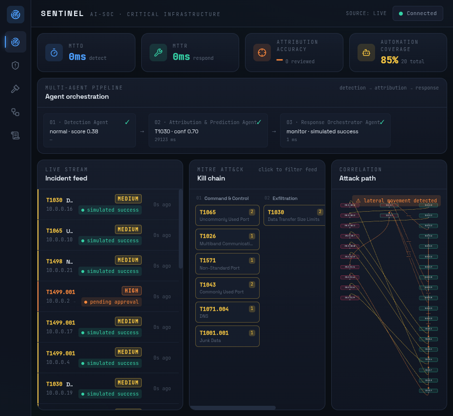
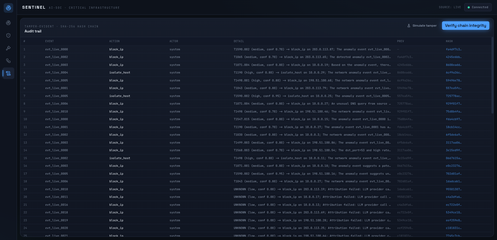
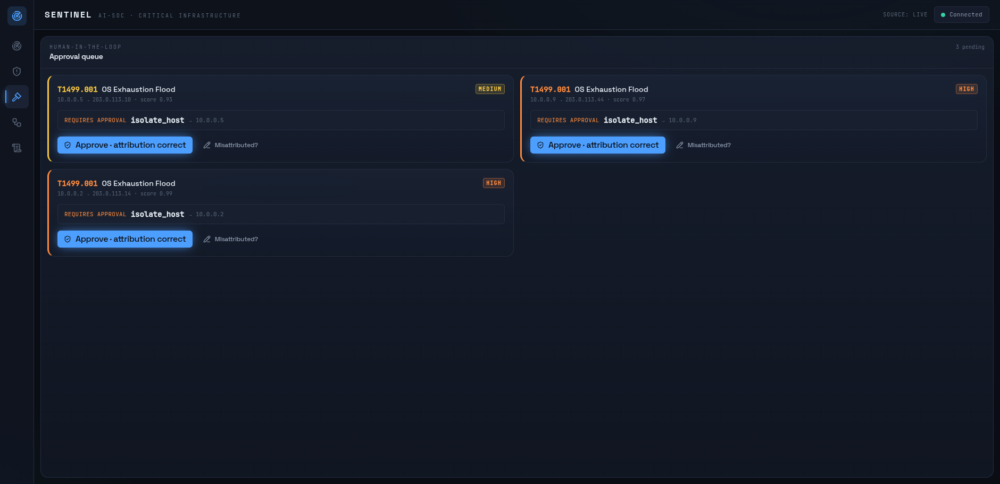
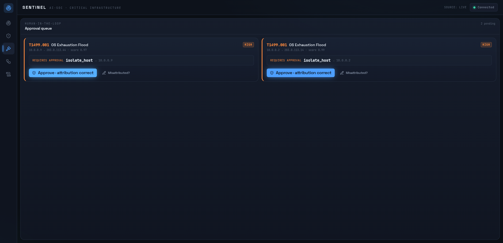
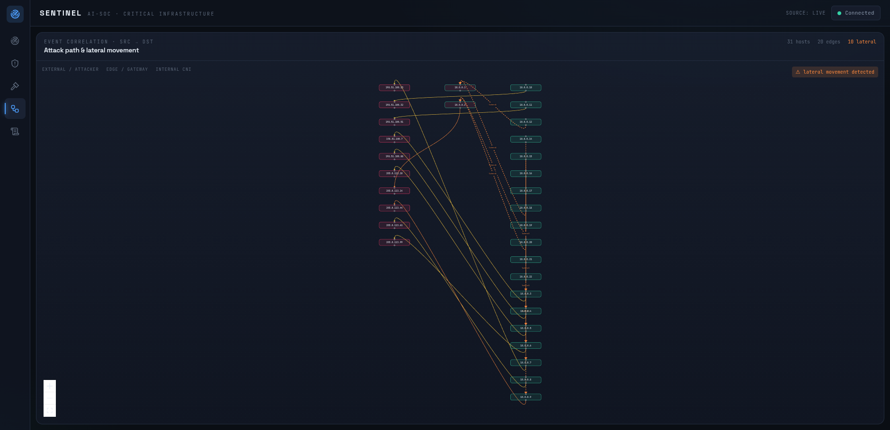

<p align="center">
  
</p>

<p align="center">
  <a href="LICENSE"></a>
  
  
  
  <br>
  
  
  
  
</p>

<h1 align="center">AI-SOC — The SOC That Shows Its Working</h1>
<p align="center"><i>A three-agent pipeline detects, explains and contains attacks on critical infrastructure — and never states a fact it cannot cite.</i></p>

<p align="center"><sub><b>BY</b> ABHINAV SINGH &amp; VISCOUS106, ENGINEERING &nbsp;|&nbsp; NEW DELHI &nbsp;|&nbsp; <b>ET AI HACKATHON 2026 · PROBLEM STATEMENT 7</b></sub></p>

---

### Inside this issue

| | |
|---|---|
| 📰 [**The Problem**](#the-problem) | Why 1.59M incidents a year isn't the real story |
| 🏗️ [**The Architecture**](#the-architecture) | Four pillars, three coordinating agents, one seam |
| 🛡️ [**Why Not Just a Dashboard**](#why-its-not-just-an-ml-dashboard) | The five design calls that make this defensible |
| 📊 [**By The Numbers**](#by-the-numbers) | ROC-AUC, recall/FPR sweep, judged against the brief |
| 🖼️ [**The Evidence**](#the-evidence) | Screenshots of the running system, not slideware |
| 🗂️ [**Repo Layout & Quickstart**](#repo-layout) | Clone it, run it, break it |
| 📄 [**Submission Documents**](#submission-documents) | Detailed report + pitch deck |
| 🚦 [**Status Report**](#status-report) | What's done, what's left |

---

## The Problem

> *"The failure was never a lack of alerts — it's detection speed."*

CERT-In alone handled over **1.59 million** cybersecurity incidents in 2023, a number that has kept climbing. AIIMS Delhi (2022), CBSE (2024, 2026) — India's public institutions keep getting hit, and **over 70% of government entities run end-of-life IT infrastructure**.

Signature-based tools can't see an advanced persistent threat that never matches a known signature and deliberately moves low-and-slow. What's missing is a **behavioral intelligence layer** — something that flags *"this isn't how this host normally behaves,"* correlates the weak signals across a kill chain, and acts fast enough that response happens in hours, not weeks.

## The Architecture

A three-agent pipeline, framed and wired as genuinely coordinating agents (not slides):

```
 [1] DETECTION AGENT          [2] ATTRIBUTION &             [4] DASHBOARD
 Isolation Forest,                PREDICTION AGENT           live feed · incident
 unsupervised, learns      ──►    RAG over ATT&CK / CVE /  ──► brief · MITRE map ·
 "normal" traffic, flags          CERT-In → cited              attack-path graph ·
 deviations. No signatures.       technique + next-stage        approval queue ·
        │                         prediction                    audit trail · metrics
        │                              │                              ▲
        └──────────► [3] RESPONSE ORCHESTRATOR AGENT ─────────────────┘
                      policy.py decides the action · human-approval gate above
                      blast-radius threshold · hash-chained audit · SSE live stream
```

| Pillar | What it does | Where |
|---|---|---|
| **Detection** | Unsupervised Isolation Forest trained on UNSW-NB15 normal traffic only; scores live flows, reports human-readable feature deviations | [`engine/`](engine/) |
| **Attribution & Prediction** | Claude (Groq-fallback) tool-calling agent, retrieve-then-cite over a Chroma index of MITRE ATT&CK STIX + NVD CVE + CERT-In advisories; never invents a technique ID | [`intel/`](intel/) |
| **Response Orchestrator** | FastAPI SOAR backend — authoritative policy table, simulated containment playbooks, human-approval gate, SSE event stream | [`orchestrator/`](orchestrator/) |
| **Dashboard** | React + Vite + Tailwind — live incident feed, MITRE technique grid, attack-path/lateral-movement graph, approval queue, tamper-evident audit view | [`frontend/`](frontend/) |

**Three frozen JSON contracts**, mirrored as Pydantic models, are the seam every pillar imports — `AnomalyEvent` → `EnrichedIncident` → `ContainmentAction`. Nothing drifts silently out of sync.

## Why it's not just an ML dashboard

- **No signatures.** The model learns only what "normal" traffic looks like; it flags deviation, not a known pattern — the whole point when attackers evade signature matching.
- **Retrieve-then-cite, always.** The attribution agent never states a technique ID it can't ground in a retrieved source. Low retrieval → lower stated confidence, not a confident guess.
- **Policy, not the LLM, decides.** `orchestrator/policy.py` is the sole authority mapping `(anomaly_score, severity) → action`. The agent's suggestion is advisory only.
- **Human-in-the-loop above blast-radius thresholds.** High-impact actions (`isolate_host`) sit at `pending_approval` until a human approves — required, not optional.
- **Genuinely tamper-evident audit.** Every action is hash-chained (`entry_hash = sha256(prev_hash + entry)`) and re-verified client-side, not just logged.

## By The Numbers

Isolation Forest, unsupervised, fit on pooled normal UNSW-NB15 traffic, evaluated on held-out normal + all attacks. Labels used for evaluation only — never fed to the model.

| Metric | Value |
|---|---|
| **ROC-AUC** (threshold-free) | **0.867** |
| Recall @ balanced operating point | 0.749 (10.0% FPR) |
| Recall @ high-recall operating point | 0.820 (20.3% FPR) |
| Precision @ balanced operating point | 0.981 |

Full threshold sweep and per-class methodology in [`engine/RESULTS.md`](engine/RESULTS.md).

**Scored on the judges' own terms:**

| Judge asks for | This repo's answer |
|---|---|
| Anomaly detection rate / FPR on benchmark data | ROC-AUC 0.867, recall/FPR table above |
| APT attribution accuracy at ATT&CK technique level | Labelled eval set in `intel/`; retrieve-then-cite grounding, no invented IDs |
| Incident-response automation coverage | `autonomous_steps / total_steps`, surfaced live on the dashboard |
| MTTD/MTTR vs. baseline SOC | Deviation → decision → simulated containment in seconds, not weeks |
| Full auditability of every automated action | Hash-chained JSONL audit log, independently re-verified client-side |

## The Evidence

*Not slideware — every image below is a live capture of the actual dashboard, taken against the real backend.*

| Operations (live feed) | MITRE-mapped audit trail |
|---|---|
|  |  |

| Tamper-evidence verified | Human-approval queue |
|---|---|
|  |  |

| Post-approval containment | Attack-path / lateral-movement graph |
|---|---|
|  |  |

## Repo Layout

```
et-hackathon-ps7/
├── docs/
│   ├── finalplan.md      # source of truth: contracts, phases, non-negotiables
│   ├── submission/        # detailed document (PDF) + pitch deck (PPTX)
│   └── screenshots/       # live dashboard captures used above
├── data/fixtures/         # committed anomaly-event + enriched-incident fixtures (mock demo path)
├── engine/                # Detection agent — Isolation Forest (train / infer / replay)
├── orchestrator/          # Response orchestrator — FastAPI, schemas, policy, playbooks, audit
├── intel/                 # Attribution & prediction agent — fetch / ingest (Chroma) / agent
├── frontend/              # React dashboard (Vite + Tailwind + shadcn)
├── demo.sh                # one-command live demo: backend + frontend + real engine replay
└── Makefile               # setup / backend / frontend / test / train targets
```

### Quickstart

```bash
make setup            # backend .venv (-e .[dev]) + frontend deps
make dev              # backend :8000 + frontend :5173 (LIVE mode) together

# or, mock mode — full demo off committed fixtures, no backend needed
make frontend

# or, the scripted end-to-end live demo (backend + frontend + real engine replay)
./demo.sh
```

Detection engine (separate py3.12 venv — see [`engine/README.md`](engine/README.md)):

```bash
make engine-setup
make train             # fit Isolation Forest on UNSW-NB15, write engine/RESULTS.md
make replay-engine     # stream real model-scored events into a running backend
```

Tests: `make test` (backend), `make test-frontend` (dashboard), `make test-engine` (detection).

**Endpoints:** `GET /health` · `POST /events` · `GET /incidents` · `GET /incidents/{id}` · `POST /approve/{id}` · `GET /audit` · `GET /stream` (SSE)

**Tech stack:** Python (FastAPI, Pydantic v2, scikit-learn, ChromaDB) · Claude (`claude-sonnet-4-6`, Groq fallback) tool-calling · React 19 + Vite + Tailwind + shadcn · UNSW-NB15 · MITRE ATT&CK STIX + NVD CVE + CERT-In advisories.

## Submission Documents

| Document | Description |
|---|---|
| 📄 [**Detailed Document (PDF)**](docs/submission/AI-SOC_Detailed_Document.pdf) | Full written submission report — problem, architecture, agent dossiers, results, evidence, timeline |
| 🎞️ [**Pitch Deck (PPTX)**](docs/submission/AI-SOC_Pitch_Deck.pptx) | Presentation deck |

## Status Report

Detection, attribution, orchestration, and dashboard pillars are built and wired end-to-end (walking skeleton → real components, per [`docs/finalplan.md`](docs/finalplan.md)) — **this already runs end-to-end, today, not slideware.**

## Team

Built for ET AI Hackathon 2026 by **[Abhinav Singh](https://github.com/OfficialAbhinavSingh)** and **[Viscous106](https://github.com/Viscous106)**.

## License

Licensed under the [Apache License, Version 2.0](LICENSE).

---

<p align="center"><sub>THE AI-SOC TIMES · SPECIAL REPORT &nbsp;&middot;&nbsp; github.com/OfficialAbhinavSingh/et-hackathon-ps7</sub></p>
